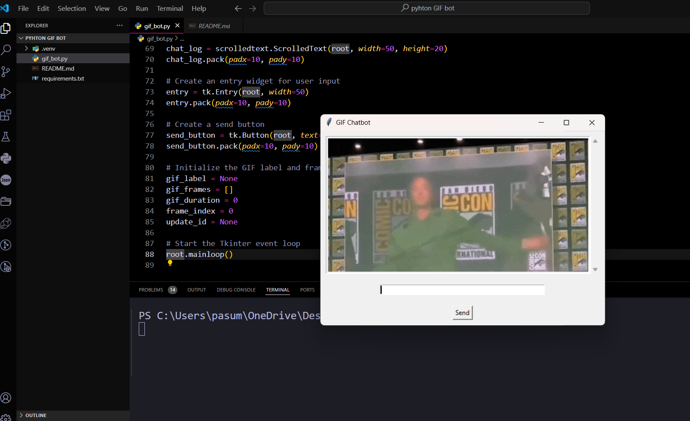

# GIF Chatbot

A simple chatbot with a graphical user interface (GUI) that can reply with animated GIFs based on user input. This project uses the Giphy API to fetch GIFs and the Tkinter library for the GUI.

## Table of Contents

- [Features](#features)
- [Requirements](#requirements)
- [Installation](#installation)
- [Usage](#usage)
- [Contributing](#contributing)
- [License](#license)

## Features

- Fetch GIFs from the Giphy API based on user input.
- Display animated GIFs directly in the chat window.
- Simple and intuitive user interface using Tkinter.

## Requirements

- Python 3.x
- `requests` library for making HTTP requests.
- `Pillow` library for handling images and GIFs.

## Installation

1. Clone the repository:

    ```sh
    git clone https://github.com/Harish-Pasumarthi/gif-chatbot.git
    cd gif-chatbot
    ```

2. Install the required dependencies:

    ```sh
    pip install -r requirements.txt
    ```

3. Replace `'API_KEY'` in the `gif_bot.py` file with your actual Giphy API key. You can obtain an API key by signing up at [Giphy Developers](https://developers.giphy.com/).

    ```python
    def fetch_gif(query):
        api_key = 'API_KEY'  # Replace 'API_KEY' with your actual Giphy API key
        # rest of the code
    ```

## Usage

1. Run the chatbot:

    ```sh
    python gif_bot.py
    ```

2. Enter your query in the input field and click the "Send" button. The chatbot will fetch and display a relevant GIF from the Giphy API.

## Contributing

Contributions are welcome! If you find any issues or have suggestions for improvements, please open an issue or submit a pull request.

## License

This project is licensed under the MIT License. See the [LICENSE](LICENSE) file for details.

## Screenshots



---
"# gif_bot" 
"# gif-chatbot" 
"# gif-chatbot" 
